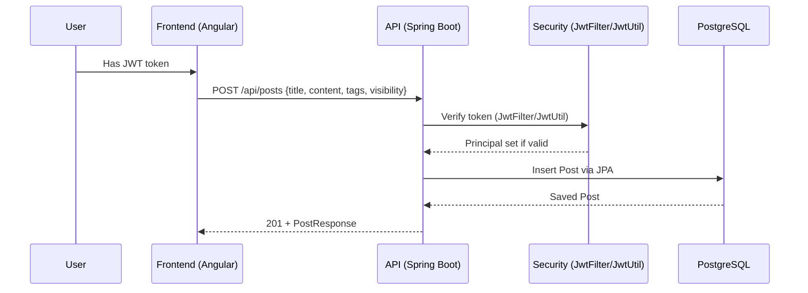
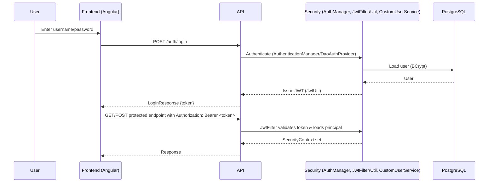

# Technical Context Document

## 1. System Overview

DevConnect is a stateless REST API + Angular SPA that connects developers through profiles, posts, comments, and lightweight reactions. The technical design prioritizes:

- Simple, synchronous request handling with stateless JWT authentication
- Clear ownership rules for updates/deletes
- Public-read surface (search, public posts/comments/reactions)
- PostgreSQL persistence via JPA/Hibernate

This document aligns with the business intent described in [context/business-domain-context.md](business-domain-context.md) — especially private posts treated as drafts, reactions driving outcomes, and admins planned for moderation and featured curation.

## 2. Architecture Overview

Components and boundaries:

- Controllers: HTTP endpoints for auth, users, posts, comments, reactions, search
  - Examples: [dev_connect_backend/src/main/java/com/example/demo/controller](../dev_connect_backend/src/main/java/com/example/demo/controller)
- Services: Domain operations and business rules
  - Examples: [AuthService](../dev_connect_backend/src/main/java/com/example/demo/AuthService.java), [UserService](../dev_connect_backend/src/main/java/com/example/demo/UserService.java), [PostService](../dev_connect_backend/src/main/java/com/example/demo/post/PostService.java), [CommentService](../dev_connect_backend/src/main/java/com/example/demo/CommentService.java), [ReactionService](../dev_connect_backend/src/main/java/com/example/demo/reaction/ReactionService.java), [SearchService](../dev_connect_backend/src/main/java/com/example/demo/SearchService.java)
- Security: Stateless JWT
  - [JwtFilter](../dev_connect_backend/src/main/java/com/example/demo/security/JwtFilter.java) (intercepts requests, skips public paths)
  - [JwtUtil](../dev_connect_backend/src/main/java/com/example/demo/security/JwtUtil.java) (generate/validate tokens)
  - [SecurityConfig](../dev_connect_backend/src/main/java/com/example/demo/config/SecurityConfig.java) (public vs protected routes)
- Persistence: Spring Data JPA repositories over PostgreSQL
  - Examples: [UserRepository](../dev_connect_backend/src/main/java/com/example/demo/repository/UserRepository.java), [PostRepository](../dev_connect_backend/src/main/java/com/example/demo/repository/PostRepository.java), [CommentRepository](../dev_connect_backend/src/main/java/com/example/demo/repository/CommentRepository.java), [ReactionRepository](../dev_connect_backend/src/main/java/com/example/demo/repository/ReactionRepository.java)
- Error handling: [GlobalExceptionHandler](../dev_connect_backend/src/main/java/com/example/demo/exception/GlobalExceptionHandler.java)
- Documentation: Swagger via springdoc-openapi

Mermaid – System Context:

```mermaid
flowchart LR
  U[User] <--> F[Angular Frontend]
  F <--> A[DevConnect API (Spring Boot)]
  A <--> DB[(PostgreSQL)]
```

## 3. Execution Model

- Sync HTTP request/response across all endpoints
- Stateless security using Bearer JWT; no server-side sessions
- No async workers, queues, or scheduled jobs present

Mermaid – Request Flow (Create Post):



## 4. Data & State Management

- Datastore: PostgreSQL (Docker-compose or local) with JPA/Hibernate (`ddl-auto=update`)
- Entities and relationships:
  - [User](../dev_connect_backend/src/main/java/com/example/demo/entity/User.java)
  - [Post](../dev_connect_backend/src/main/java/com/example/demo/entity/Post.java) (many-to-one User; one-to-many Reaction; tags as `@ElementCollection`)
  - [Comment](../dev_connect_backend/src/main/java/com/example/demo/entity/Comment.java) (many-to-one User and Post)
  - [Reaction](../dev_connect_backend/src/main/java/com/example/demo/entity/Reaction.java) (many-to-one User; targets Post or Comment)
- Consistency: Strong consistency per request; transactional writes through JPA
- Idempotency & toggles:
  - Reactions: submitting the same type twice removes prior reaction (toggle off); changing type updates it
- Privacy:
  - `PRIVATE` posts are drafts — no comments or reactions; publishing occurs by switching to `PUBLIC`

## 5. External Dependencies

- No external SaaS APIs or queues found; inbound clients are the Angular app and any REST consumers
- Libraries:
  - JWT: `io.jsonwebtoken` (jjwt)
  - API docs: `springdoc-openapi`
  - Auth: Spring Security + BCrypt password hashing

## 6. Key Technical Decisions

- Stateless JWT authentication: aligns with horizontal scalability and public-read surface; avoids session management
- Single user role (today): simplifies MVP; admins planned for moderation/featured curation (business context)
- Free-form `skills` and `tags`: prioritizes flexibility and user expression; avoids early taxonomy constraints
- Search on public posts only: supports public discovery; avoids private/draft exposure
- Ownership enforcement via repository queries and `AuthUtil`: ensures user-only updates/deletes

## 7. Failure Modes & Reliability

- Auth failures (401): handled via [JwtAuthenticationEntryPoint](../dev_connect_backend/src/main/java/com/example/demo/config/JwtAuthenticationEntryPoint.java)
- Access Denied (403): thrown for unauthorized ownership actions
- Resource Not Found (404): standardized via `ResourceNotFoundException` handling
- Validation errors (400): DTO validation surfaced by `GlobalExceptionHandler`
- Data integrity (409): unique constraints (username/email) handled with tailored messaging
- Database down (503): `DataAccessException` mapped to service unavailable
- No built-in retries/circuit breakers; synchronous model relies on immediate success/failure

Mermaid – Login + JWT Validation:



## 8. Security & Access Control

- Public endpoints (permitAll in `SecurityConfig`): register, login, search, public posts, comments, reactions, Swagger
- Protected endpoints: `my-profile`, create/update/delete posts, reactions to comments/posts
- Ownership checks: [AuthUtil](../dev_connect_backend/src/main/java/com/example/demo/security/AuthUtil.java) and repository filters enforce user identity
- Admins planned: policy/moderation/featured curation (not implemented)

## 9. Observability & Operations

- Logging: default Spring logging; `spring.jpa.show-sql=true` for development visibility
- Docs: Swagger UI available at `/swagger-ui/**` and `/v3/api-docs/**`
- No metrics/tracing integrated; consider adding Micrometer/Prometheus for production
- Configuration via `application.properties` with env overrides; see [dev_connect_backend/src/main/resources/application.properties](../dev_connect_backend/src/main/resources/application.properties)

## 10. Scalability & Evolution

- Horizontally scalable API due to stateless JWT
- PostgreSQL is a single-instance dependency; scale via indexes/tuning and eventual read replicas if needed
- Potential next steps aligned with business context:
  - Admin role enablement and moderation tooling
  - Featured posts curation informed by reaction signals
  - Optional profile search expansion (skills/bio) if required

## 11. Assumptions & Open Questions

- Admin workflows: moderation queues, thresholds, and featured selection criteria are not yet implemented
- Rate limiting: none observed; consider limits to protect public endpoints from abuse
- Pagination defaults: business expectations for page size/limits should be confirmed
- Data migrations: `ddl-auto=update` is convenient for dev; production should use migrations

---

## Appendix: Key Source References

- Controllers: [dev_connect_backend/src/main/java/com/example/demo/controller](../dev_connect_backend/src/main/java/com/example/demo/controller)
- Security: [dev_connect_backend/src/main/java/com/example/demo/security](../dev_connect_backend/src/main/java/com/example/demo/security)
- Config: [dev_connect_backend/src/main/java/com/example/demo/config](../dev_connect_backend/src/main/java/com/example/demo/config)
- Services: [dev_connect_backend/src/main/java/com/example/demo](../dev_connect_backend/src/main/java/com/example/demo)
- Entities: [dev_connect_backend/src/main/java/com/example/demo/entity](../dev_connect_backend/src/main/java/com/example/demo/entity)
- Repositories: [dev_connect_backend/src/main/java/com/example/demo/repository](../dev_connect_backend/src/main/java/com/example/demo/repository)
